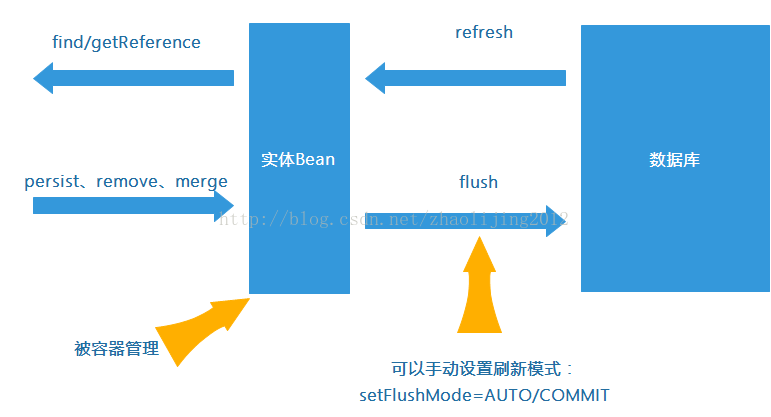

&emsp;&emsp;在使用JpaRepository接口进行数据的删除操作过程中发现，当首先使用自定义的deleteBy方法删除某一数据实体，然后再对该数据实体（删除ID的值）进行save时（deleteBy和save的调用是在同一个事务当中且为连续的调用），会发生数据库错误，根据log，知道是违反了唯一键约束。说明deleteBy并没有成功。但是如果在两个方法调用之间插入一个查询，则持久化能够成功。下面分析下原因。
&emsp;&emsp;自定义的deleteBy方法已经使用@Transactional以及@Modifying进行注解并且调用该函数的地方也使用了@Transactional进行注解，按理来说应该已经保证了deleteBy方法能够执行，那么为什么会失败呢？其实，由于Jpa底层默认使用的是Hiberanate框架来实现的，所以产生该问题的根源是在Hiberanate。首先，让我们先来看一张图：

&emsp;&emsp;其实，在内存中，有一份Hiberanate进行管理的``缓存``。我们调用Jpa进行deleteBy时，其实是作用在这部分缓存上的，并没有真正地写到数据库当中。Hibernate会尽量将与数据库的操作延迟，直到必须要与数据库进行交互，例如save方法一般会在提交时才真正执行，最终在提交时会以批处理的方式与数据库进行交互，以提高效率。而将操作延迟，就是利用缓存，将最后要处理的操作放到缓存中。
&emsp;&emsp;因此，如果要将缓存中的数据持久化到数据库中，则需要调用JpaRepository的flush()方法（内部调用了EntityManager的flush()方法）来完成，flush方法的主要作用就是清理缓存，强制数据库与Hibernate缓存同步，以保证数据的一致性。但即使调用了该函数，数据也还是没有持久化到数据库中。这是因为，前面也提到过，deleteBy和save的调用是在同一个事务当中，而根据Hibernate的机制，flush()方法进行清理缓存的操作,它的主要动作就是向数据库发送一系列的sql语句，并执行这些sql语句，但是不会向数据库提交。而只有到将事务进行提交时，数据库才会去执行这些SQL，将数据持久化到数据库中。因此，即使在事务过程当中调用了flush()方法，也无法保证数据被持久化。而之所以加上查询后能够进行持久化，就是因为，执行查询时，会首先将事务进行提交才执行查询，因此deleteBy才成功了。

&emsp;&emsp;欢迎关注个人公众号：
