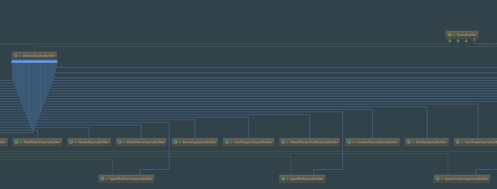

# ELK
ELK是由Elasticsearch、Logstash、Kibana三部分组成：
1. Elasticsearch是个开源分布式搜索引擎，它的特点有：分布式，零配置，自动发现，索引自动分片，索引副本机制，restful风格接口，多数据源，自动搜索负载等。
2. Logstash是一个完全开源的工具，他可以对你的日志进行收集、过滤，并将其存储供以后使用（如，搜索）。
3. Kibana 也是一个开源和免费的工具，Kibana可以为 Logstash 和 ElasticSearch 提供的日志分析友好的 Web 界面，可以帮助您汇总、分析和搜索重要数据日志。
在大多数情况下，我们都是使用ELK来进行日志的收集及分析工作，直接在Kibana中查看数据信息。那么，如果我们需要利用ELK的能力进行二次开发的话，就需要使用net.logstash.logback来完成我们的需求。有关ELK的部署读者可以参考其他的文章来完成，本文重点介绍在SpringBoot中操作ELK数据的方法及过程。


# SpringBoot中使用ELK
1. 添加依赖
要在SpringBoot中使用ELK，需要添加依赖：
compile group: 'com.github.vanroy', name: 'spring-boot-starter-data-jest', version: '3.0.0.RELEASE'
在该包中，有我们操作ELK所需要的接口。
2. 配置ELK路径
在SpringBoot的配置文件当中，配置ELK的路径：spring.data.jest.uri     = http://ipAddress:9200
3. 注入JestClient对象
在需要使用到ELK的模块中，注入JestClient对象，建议实现一个公共的接口，提供ELK功能，这样只需要在该代码中进行一次注入即可：
```
@Autowired
private JestClient jestClient;
```
接下来，就可以使用jestClient操作ELK的数据了。下面我们将来看看如何通过JestClient操作ELK。

# JestClient操作ElasticSearch数据
ElasticSearch使用查询表达是来进行数据的检索。查询表达式(Query DSL)是一种非常灵活又富有表现力的查询语言。Elasticsearch 使用它可以以简单的JSON接口来展现Lucene功能的绝大部分。在应用中，用它来编写查询语句。它可以使查询语句更灵活、更精确、易读和易调试。要使用这种查询表达式，只需将查询语句传递给 query 参数：
```
GET /my_store/products
{
    "query": YOUR_QUERY_HERE
}
```
同理，ElasticSearch中的其他操作，也是使用类似于该表达式的方式来操作的，比如，添加记录的的方式：
```
POST /my_store/products/_bulk
{ "index": { "_id": 1 }}
{ "price" : 10, "productID" : "XHDK-A-1293-#fJ3" }
{ "index": { "_id": 2 }}
{ "price" : 20, "productID" : "KDKE-B-9947-#kL5" }
{ "index": { "_id": 3 }}
{ "price" : 30, "productID" : "JODL-X-1937-#pV7" }
{ "index": { "_id": 4 }}
{ "price" : 30, "productID" : "QQPX-R-3956-#aD8" }
```
关于ElasticSearch的DSL语言部分，有机会的话会单独写一篇文章来总结下，这里只做一个简单的介绍。重要的是，如何通过JestClient来操作ElasticSearch。我们以一个简单的查询操作来看下：
1. 构建过滤条件：
```
BoolQueryBuilder queryBuilder = boolQuery().must(termQuery("dataId.id", 2101987));
queryBuilder.must(termQuery("dataId.dataSetId", QueryParser.escape(fdmt_main_oper_item)));
queryBuilder.must(termQuery("operator", operator));
```
2. 将条件对象转换位条件语句：
```
String queryString = new SearchSourceBuilder().query(queryBuilder).toString();
```
3. 使用条件语句进行查询：
```
Search search = new Search.Builder(queryString).addIndex(DATA_LIFECYCLE_INDEX).addType(DATA_LIFECYCLE_TYPE).build();
SearchResult result = jestClient.execute(search);
```
来看下第二步操作获取到的字符串：
```
{
  "query" : {
    "bool" : {
      "must" : [
        {
          "term" : {
            "dataId.id" : {
              "value" : "2101987",
              "boost" : 1.0
            }
          }
        },
        {
          "term" : {
            "dataId.dataSetId" : {
              "value" : "fdmt_main_oper_item",
              "boost" : 1.0
            }
          }
        }
      ],
      "disable_coord" : false,
      "adjust_pure_negative" : true,
      "boost" : 1.0
    }
  }
}
```
从结构中可以看出，这正是ElasticSearch结构化查询表达式的后半部分，那么，只要把前半部分补充上，不久可以进行查询了吗。而：
```
new Search.Builder(queryString).addIndex(DATA_LIFECYCLE_INDEX).addType(DATA_LIFECYCLE_TYPE)；
```
所做的操作，也就是补全查询表达的查询路径而已。
接下来我们看看JestClient的execute接口做的操作。在JestClient接口的实现JestHttpClient中，可以看到：
```java
public <T extends JestResult> T execute(Action<T> clientRequest, RequestConfig requestConfig) throws IOException {
        HttpUriRequest request = prepareRequest(clientRequest, requestConfig);
        CloseableHttpResponse response = null;
        try {
            response = executeRequest(request);
            return deserializeResponse(response, request, clientRequest);
        } catch (HttpHostConnectException ex) {
            throw new CouldNotConnectException(ex.getHost().toURI(), ex);
        } finally {
            if (response != null) {
                try {
                    response.close();
                } catch (IOException ex) {
                    log.error("Exception occurred while closing response stream.", ex);
                }
            }
        }
    }
```
execute接口所做的工作，就是发起Http请求，根据url去访问ElasticSearch。由此我们可以看出，使用JestClient来操作ElasticSearch其实很简单，重要的是将ElasticSearch的Restful风格的操作接口构建出来，而ElasticSearch中的所使用到的相关的关键字，都有对应的函数实现。在上面查询条件的构造当中，我们使用了boolQuery(),其在ElasticSearch的结构化查询语言中其实就是对应着``"bool" : {}``。boolQuery()方法返回的是一个BoolQueryBuilder的对象，该类继承自AbstractQueryBuilder抽象类，在该抽象类下，有多大几十个的子类：

这些子类都对应着ElasticSearch中的某一个关键字，具体的大家可以打看IDEA查看下抽象类的具体子类。
至此，在SringBoot中操作ElasticSearch的的步骤及方法大致清楚了,关于c查询结果SearchResult，大致也是存在着与查询：
```
GET /my_store/products
{
    "query": YOUR_QUERY_HERE
}
```
的结果的对应关系，具体的可以看文档中介绍了。

欢迎关注个人公众号：
