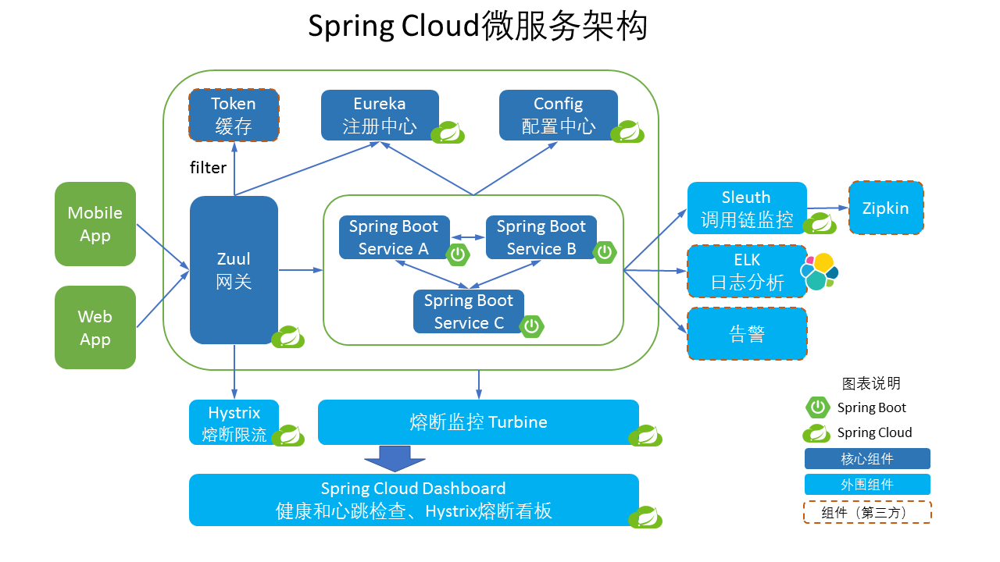

&emsp;&emsp;现在去看很多公司的招聘信息，都会发现越来越多的公司都有对SpringCloud的要求，自己目前所在公司的一部分业务也是建立在Spring Cloud上的。今天开始，将单独开设一个SpringCloud主题，讲解Spring Cloud的使用。
&emsp;&emsp;在使用了一段时间的SpringBoot之后，我们会想，如果说SpringBoot的思想是将大型的Web服务拆分为低耦合、高内聚的微服务的话，当拆分出来的微服务较多后，如果来（分布式环境或非分布式环境）有效地管理这些微服务，以及各微服务如何与其他微服务进行交互便成了问题。如果是最原始的方案，当某一个微服务需要调用其他微服务的时候，需要知道其他微服务的地址信息，以及接口信息。但是当系统内部的微服务关系错综复杂时，难道一个微服务的地址更改之后，需要修改并重新其他相关联的服务吗？这样的管理方式便不再合适。而Spring Cloud从技术架构上降低了对大型系统构建的要求，使我们以非常低的成本（技术或者硬件）搭建一套高效、分布式、容错的平台。

# Spring Cloud
&emsp;&emsp;Spring Cloud是一系列框架的有序集合。它利用Spring Boot的开发便利性巧妙地简化了分布式系统基础设施的开发，如服务发现注册、配置中心、消息总线、负载均衡、断路器、数据监控等，都可以用Spring Boot的开发风格做到一键启动和部署。Spring并没有重复制造轮子，它只是将目前各家公司开发的比较成熟、经得起实际考验的服务框架组合起来，通过Spring Boot风格进行再封装屏蔽掉了复杂的配置和实现原理，最终给开发者留出了一套简单易懂、易部署和易维护的分布式系统开发工具包。

&emsp;&emsp;当一个Web请求到来时，系统内部的调用过程如下：
1. 外部或者内部的非Spring Cloud项目都统一通过API网关（Zuul）来访问内部服务.
2. 网关接收到请求后，从注册中心（Eureka）获取可用服务
3. 由Ribbon进行均衡负载后，分发到后端的具体实例
4. 微服务之间通过Feign进行通信处理业务
5. Hystrix负责处理服务超时熔断
6. Turbine监控服务间的调用和熔断相关指标

&emsp;&emsp;在上图中可以看到，整个系统是由许多微服务组成的。微服务是可以独立部署、水平扩展、独立访问（或者有独立的数据库）的服务单元，Spring Cloud就是这些微服务的大管家，采用了微服务这种架构之后，项目的数量会非常多，Spring Cloud做为大管家需要管理好这些微服务，自然需要很多小弟来帮忙。如上图中出现的Spring Cloud Config、Spring Cloud Sleuth、Spring Cloud Eureka、Spring Cloud Zuul、Spring Cloud Hystrix等等以外，还包含且不限于Spring Cloud Bus、Spring Cloud for Cloud Foundry、Spring Cloud Cluster、Spring Cloud Consul、Spring Cloud Security、Spring Cloud Data Flow、Spring Cloud Stream、Spring Cloud Task、Spring Cloud Zookeeper、Spring Cloud Connectors、Spring Cloud Starters、Spring Cloud CLI。每一个微服务都有其独一无二的作用。

## Spring Cloud 与 Spring Boot
&emsp;&emsp;Spring Boot 是 Spring 的一套快速配置脚手架，可以基于Spring Boot 快速开发单个微服务，Spring Cloud是一个基于Spring Boot实现的云应用开发工具；Spring Boot专注于快速、方便集成的单个微服务个体，Spring Cloud关注全局的服务治理框架；Spring Boot使用了默认大于配置的理念，很多集成方案已经帮你选择好了，能不配置就不配置，Spring Cloud很大的一部分是基于Spring Boot来实现，可以不基于Spring Boot吗？不可以。

Spring Boot可以离开Spring Cloud独立使用开发项目，但是Spring Cloud离不开Spring Boot，属于依赖的关系。

## Spring Cloud的优势
微服务的框架那么多比如：dubbo、Kubernetes，为什么就要使用Spring Cloud的呢？
+ 产出于spring大家族，spring在企业级开发框架中无人能敌，来头很大，可以保证后续的更新、完善。
+ 有Spring Boot 这个独立干将可以省很多事，大大小小的活Spring Boot都搞的挺不错。
+ 作为一个微服务治理的大家伙，考虑的很全面，几乎服务治理的方方面面都考虑到了，方便开发开箱即用。
+ Spring Cloud 活跃度很高，教程很丰富，遇到问题很容易找到解决方案
+ 轻轻松松几行代码就完成了熔断、均衡负载、服务中心的各种平台功能
&emsp;&emsp;Spring Cloud对于中小型互联网公司来说是一种福音，因为这类公司往往没有实力或者没有足够的资金投入去开发自己的分布式系统基础设施，使用Spring Cloud一站式解决方案能在从容应对业务发展的同时大大减少开发成本。同时，随着近几年微服务架构和Docker容器概念的火爆，也会让Spring Cloud在未来越来越“云”化的软件开发风格中立有一席之地，我目前所在的公司很多服务就是建立在微服务及容器云上的，这极大地方便了我们开发人员的开发效率，同时也减轻了运维人员的工作。

&emsp;&emsp;网上关于个Spring Cloud微服务组件的文章及书籍很多，但是很多知识只是停留在如何使用的阶段。在后面的文章当中，我将在讲解Spring Cloud各微服务功能的同时，深入去解析器内部原理，以达到知其然而知其所以然的目的。作为一个爱钻牛角尖的程序员，这也是我为什么还要写这个系列的原因。

&emsp;&emsp;欢迎关注个人公众号：
